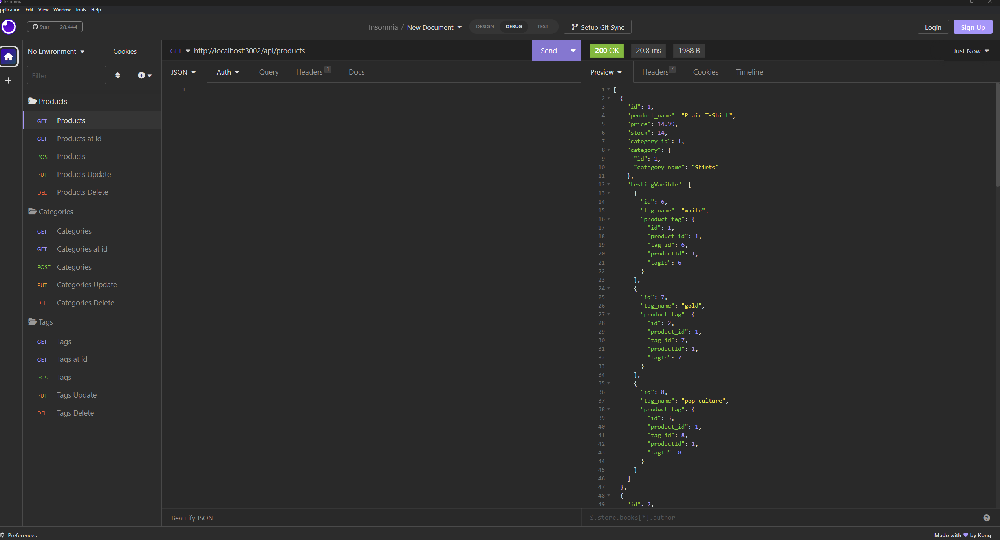
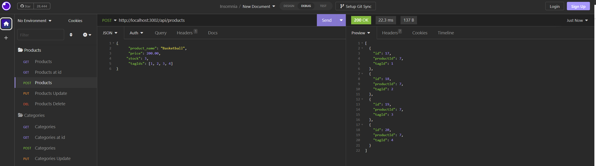
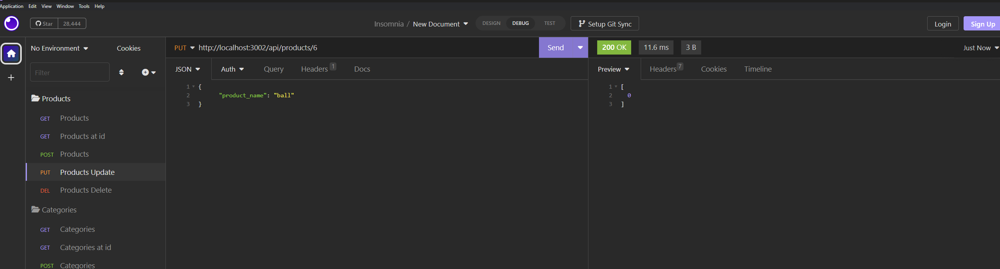
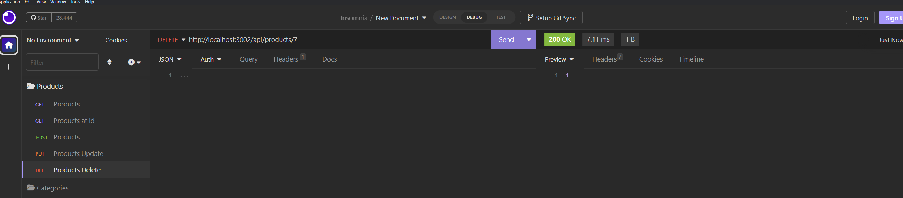

# e-commerce

## Badges

## Description

- Motivation: The motivation for this program was to have products listed in a server with a mysql database
- Goal: To test my skills with sequilize and see how far i could go with having jsut learned it
- Problems Solved: It solves the problem of mysql commands being way to hard to understand when being placed in a string using query()
- What I Learned: i learned how to use insomnia cause i never really used it until now

## Installation

node, express, sequelize, mysql2

## Usage

## License

This program is done under the license: [MIT License](https://choosealicense.com/licenses/mit/)

## How To Contribute

## Questions

GitHub: https://github.com/Albikras

If you want to reach me with additional question click my email link here: Krasniqi1287@gmail.com

## Links

test

## Video
